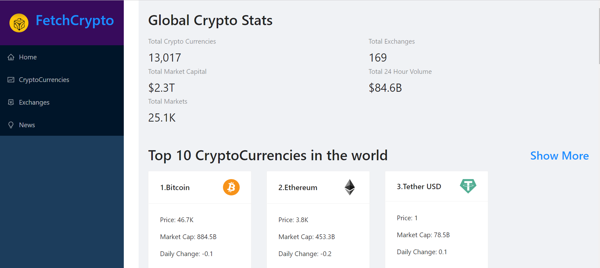
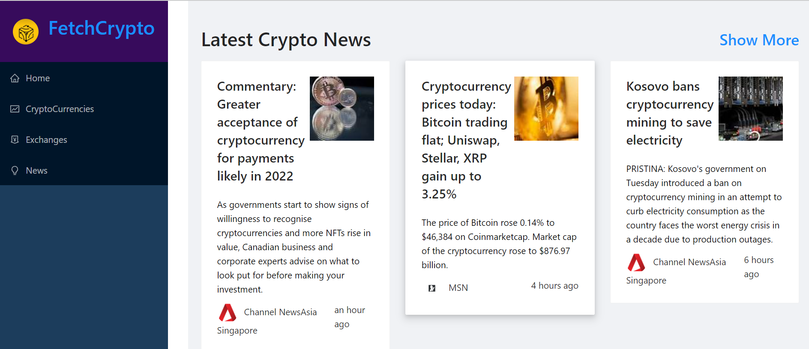
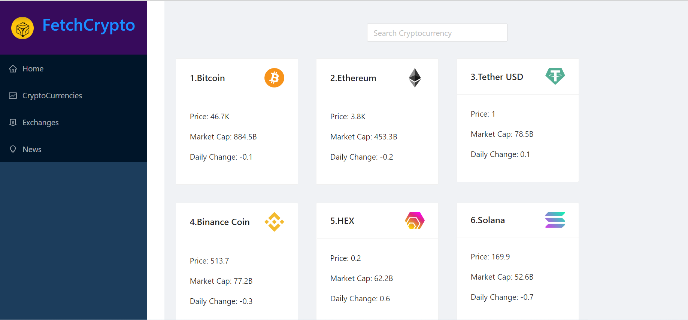
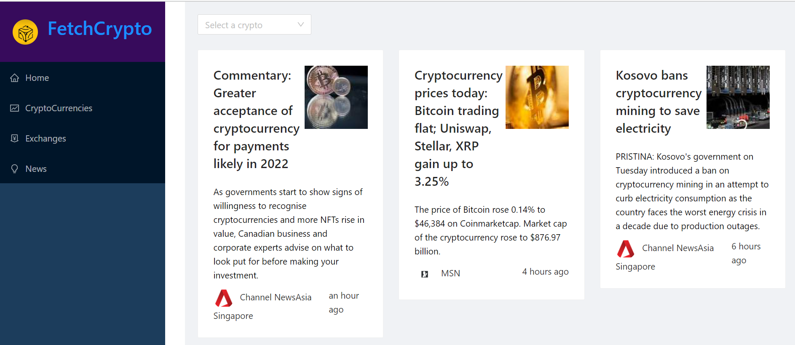

# FetchCrypto

Hosted Link: https://fetch-your-crypto.netlify.app \
 
This is a `realtime cryto app` which is meant to get the lastest information about the crypto world. Including the lastest prices and latest news about each crypto currency. 

## Home Page
 

In the home page, the first section at the top consists of the overall deatils of crypto in the market.  

The homepage starts with the `Global Crypto Stats` where fisrt of all we get the the `Total Crypto Currencies` which shows the total number of crypto that is circulated on the market. 
Then we have `Total Exchanges` which shows the total number of exchanges taking place in realtime. 
Next section has the `total market capital` which shows the amount of money that is circulated in the crypto world. 
Then comes `Total 24 Hour Volume` which shows the total money generated by the crypto coins in 24 hours. 
The `Total Markets` shows the amount of crypto coins that is being circulated in the world. 
  
Then we have the list of `Top 10 CryptoCurrencies in the world` where we have the listed 10 crypto currencies that hold the most value in the market. 
Then we have the `Latest Crypto News` where we have the most trending news about the crypto world.

 

## CyptoCurrencies
In the homepage section along with the `Top 10 CryptoCurrencies` we have a `show more` option, when this option is clicked, it will route to the `CryptoCurrencies` page where we will get the list of all the cryptocurrencies in the world.\
Here we have a `search` option where we can search among the crypto currencies available and we can get the information about that particular crypto coin.  

 

## News

In the homepage along with the `Latest News` section, we have the `show more` option, we clicked, it will route to the `News` page which consists of all the latest news about crypto coins.\
In this section we also have a `search` option which on click shows a dropdown list of all the available cryptocurrencies. When one cryptocurrency is selected, the latest news about that particular cryptocurrency will be displayed. 

  

# About the project build
This project is made using `ReactJS` and the api used is fetched using `RapidAPI`. The project consists of components which gets rendered when called from the `Navbar` whihc consists of all the routes avilable. To build this `Coin Market API` was used to get the details about each crypto coin.\
To get the news we used the `Bing News API` to get all the latest news about crypto coins.\
To fetch the API we made the `services` folder to make the files `CryptoApi.js` and `CryptoNewsApi.js`. Through this we fetched the API and the results were exported to the `app` folder where we stored the `store.js`, all the fetched results were stores in this file. Then the neccesary details were routed to their respective pages.\
For the designing purpose `Antd` was used to get the card and other type structure to store the crypto coin details. Then we used `millify` to simplify the use of different components and to make the designing more efficient.\
To make the route between different routes `axios` is used. It makes the routes more efficient.